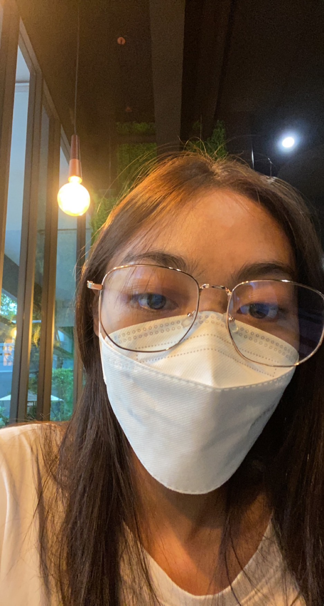

# 6310611089.github.io
<!DOCTYPE html>
<html lang="en">
<head>
    <meta charset="UTF-8">
    <meta name="viewport" content="width=device-width, initial-scale=1.0">
    <title>6310611089.github.io</title>
    
</head>
<body>

    

     
    <h1>Hello!</h1>
    
This is Nittha Kaewsombut (you can call me "Pear")

    
I'm a Computer Engineering Student at Thammasat University!

     
    <h2>Contact</h2>
    
Phone: (+66)82-307-9685

    
Email: 6310611089@student.tu.ac.th

</body>
</html>